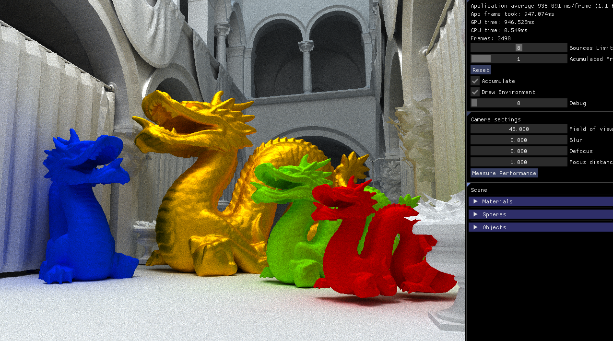
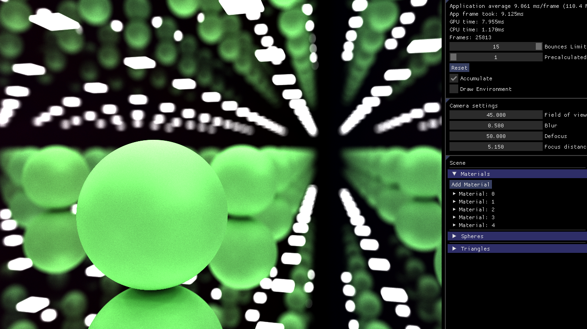
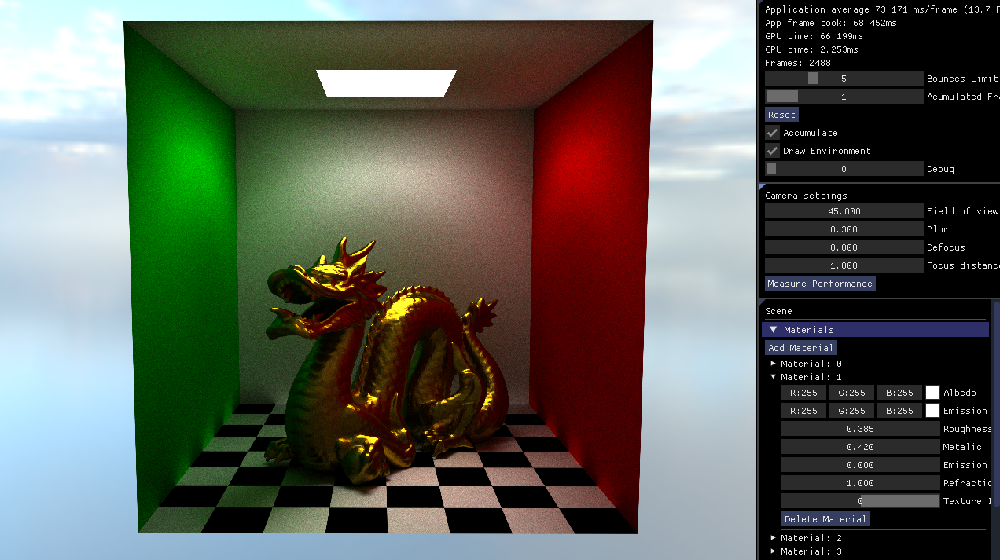

# Real-Time Ray Tracing Engine

## Preview


<div style="display:flex; justify-content:center; flex-wrap:wrap;">



</div>

[***See more***](Docs)


## Download
Before downloading source code make sure you have:

- Vulkan SDK installed on your device. You can find it here: https://www.openal.org/downloads

#### Windows:
- Visual Studio 19. You can download community version frome here: https://visualstudio.microsoft.com/vs/community

#### Other OS: Not supported yet

#### Source code
- Clone source code with command
```
    git clone --recursive https://github.com/Ridgeso/Ray-Tracing-Machine.git
```
- Alternatively clone source code to your chosen path and then fetch all submodules with command
```
    git submodule update --init
```

## Building

> Open `RayTracing` solution in the project root and change the startup project to `RayTracing`. <br>
> You can choose on of 2 builds: `Debug` and `Release` on the top bar. <br>
> Click `Ctrl + Shift + b` combination or right click on Solution and choose `Build` to build everything. <br>
> Hope everything went smoothly, otherwise let me know what went wrong.

## Running

Just click `F5` or green left arrow on the top bar. Application will run from working directory wich is [project root](RayTracing). Running application from different place will couse crash as program won't be able to load assets.
